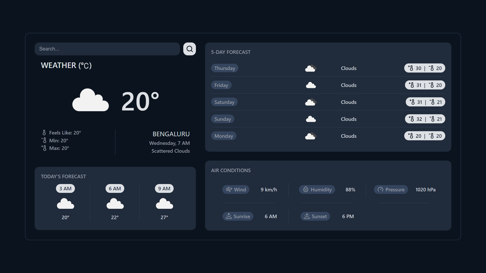

<br>
<br>

# Weather App

With the **Weather App**, users can allow current location access or search locations by city name and observe the weather for the next 5 days and 3 hours interval.
<br>
The app is developed using **React.js**
<br>
<br>

## ✨ Getting Started

-   Make sure you already have `Node.js` and `npm` installed in your system.
-   You need an API key from [OpenWeatherMap](https://openweathermap.org/). After creating an account, [grab your key](https://home.openweathermap.org/api_keys).
-   Then, under the `src` directory, create an `.env` file with the key `REACT_APP_OPENWEATHERMAP_KEY` and assign a value with your OpenWeatherMap API key. (You can refer to the `.env.sample` file)
    <br>
    <br>

## ⚡ Install

Clone the repository:

```bash
git clone https://github.com/MihirMistry2/weather_app.git
```

<br>

## 📘 Used libraries

-   `react-js`

<br>
<br>
Thank You 🙂
